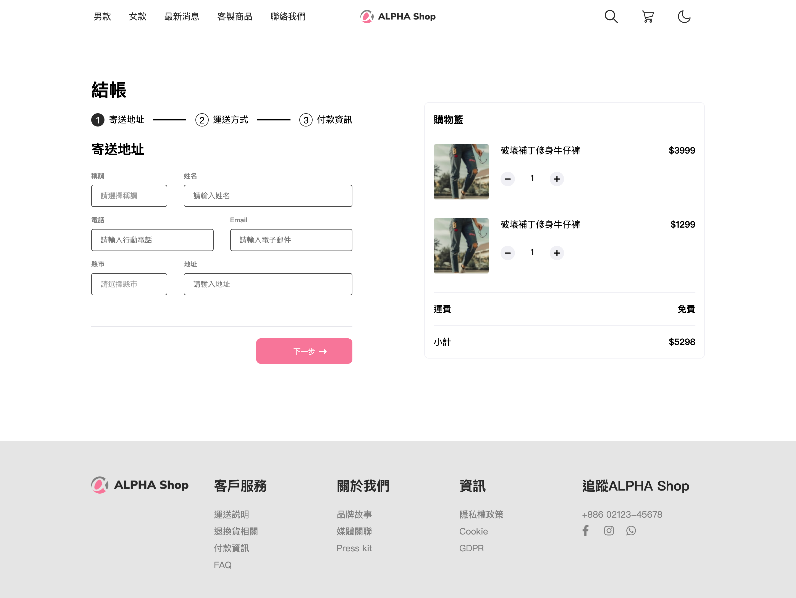
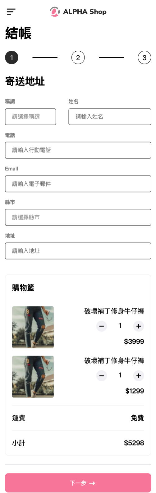

# ALPHA Shop 購物車
<center class="half">
  
</center>
## 優化

-   新增992px、769px斷點

### 開始使用

1.  請先確認有安裝 node.js 與 npm
2.  將專案 clone 到本地
```
git clone https://github.com/ga686/ac_shop.git
```
3.  在本地開啟之後，透過終端機進入資料夾，輸入：
 ```
npm install
 ```
4.  安裝完畢後，繼續輸入：
 ```
npm run build
 ```


### 開發工具
-   css-loader 3.5.3
-   file-loader 6.2.0
-   mini-css-extract-plugin 0.9.0
-   sass-loader 8.0.2
-   webpack 4.43.0
-   webpack-cli 3.3.11